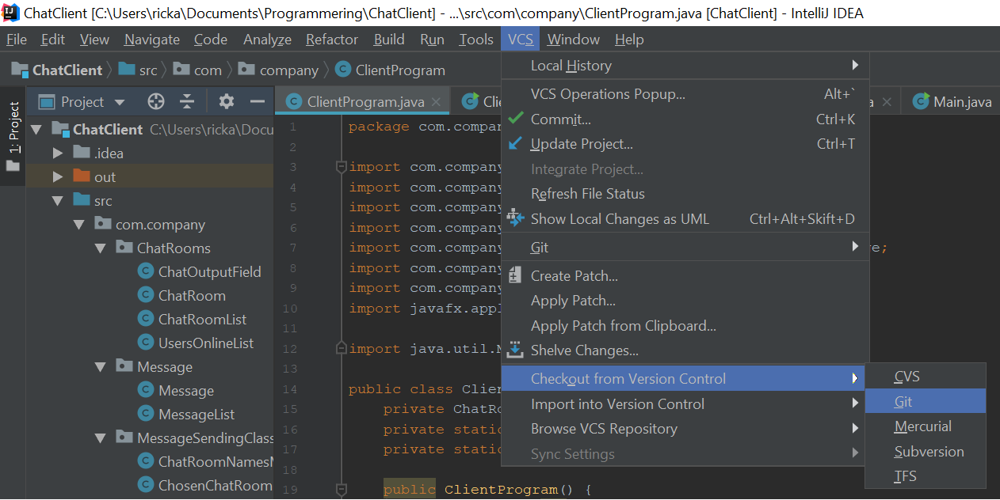
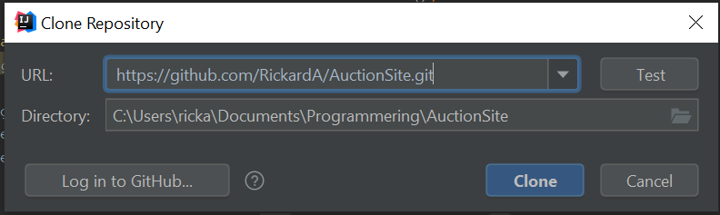
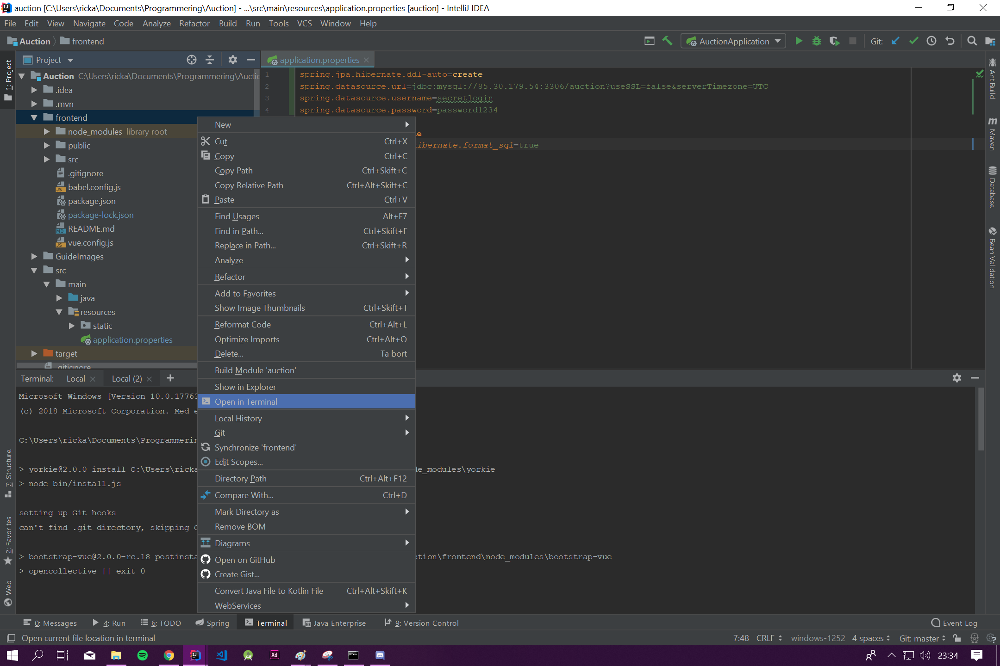

# AuctionSite
<h3>**Kom igång med Projektet**</h3>
<b>1.</b> Starta IntelliJ (Det gör inget om ett existerande projekt öppnas)   
<b>2.</b> Navigera till <b> VCS -> Checkout from Version Control -> GIT</b>   

<b>3.</b> I rutan som kommer upp klistra in följande: <link>https://github.com/RickardA/AuctionSite.git</link>  
Välj sedan vart du vill skapa det nya projektet och tryck sedan på <b>Clone</b>

<b>4.</b> Det kan hända att du blir ombedd att logga in på ditt github konto, gör då detta.  
<b>5.</b> Nu kommer följande popup komma, och där trycker vi <b>Yes</b>

<b>6.</b> Nu skapas projektet och sedan frågar Intellij om du vill öppna det i ett nytt fönster eller det som existerar 
Välj själv hur du vill göra  
<b>7.</b> Nu bygger Intellij ihop projektet och det kan ta en liten stund, när den är klar så kan du öppna upp projekt trädet med alla filer 
Tryck bara på fliken <b>Project</b> ute till vänster av fönstret  
<b>8.</b> Högerklicka på frontend mappen och välj sedan <b>Open in Terminal</b> 

<b>9.</b> I terminalen som öppnas skriver du <b>npm install</b> och tryck enter, nu installeras alla paket som finns i projektet 

<b>10.</b> Navigera nu till <b> application.properties</b> som finns under <b> Src -> Main -> Resources </b>, 
här skall du klistra in kodsnutten som jag skickade i discord  
<b>11.</b> Prova nu att köra projektet , om det startar upp utan några felmeddelanden så har du lyckats!  
<b>Nu är projektet redo till att användas, om du vill komma igång med vue ui till projektet så fortsätter du att följa guiden</b>   
<b>12.</b> Starta nu vue ui och ta dig till <link>http://localhost:8000/project/select</link>  
<b>13.</b> Tryck på <b>Import</b> och navigerar dig sedan ner till projeketet och till mappen frontend
,min sökväg ser t.ex ut såhär <b> C:\Users\ricka\Documents\Programmering\Auction\frontend</b> 

<b>14.</b> Tryck på knappen <b>Import this folder</b>

<b>15.</b> Du blir nu länkad till en annan sida, där ska du trycka <b> tasks -> build -> parameters -> output directory = ./../src/main/resources/static</b>  

<h3>Detta bör vara allt som behövs för att komma igång</h3>
